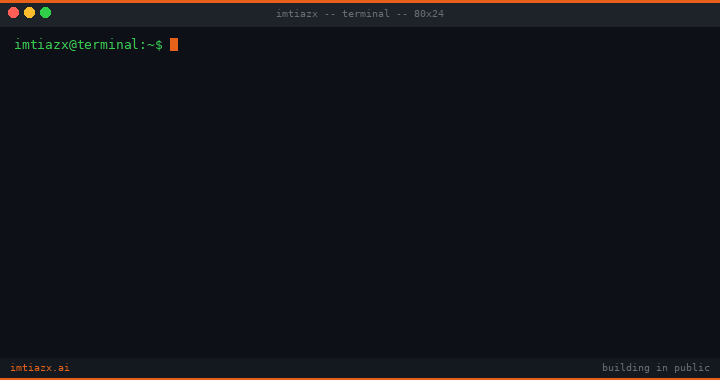

---

**`// what I'm building`**

| | Project | What |
|---|---|---|
| ✅ | **RAGScope** | Benchmarks 5 RAG strategies side by side. Faithfulness, latency, context precision. |
| 🟠 | **DocuAgent** | Multi-agent document intelligence with supervisor routing and Redis-backed memory. |
| ⚪ | **SafeScore** | Red-teaming toolkit for deployed GenAI apps. System prompts, RAG pipelines, tool configs. |
| ⚪ | **LLM Observatory** | Drop-in SDK for token cost, latency, and output quality monitoring. |
| ⚪ | **GraphRAG Lite** | Entity extraction + graph traversal + vector search with visible reasoning paths. |
| ⚪ | **PromptOps** | Version control and A/B testing for prompts with Claude-as-judge evaluation. |

✅ completed &nbsp;&nbsp; 🟠 building &nbsp;&nbsp; ⚪ planned

---

**`// numbers`**

- 5 years at Accenture Industry X
- 25+ enterprise GenAI studies delivered
- 4 disciplines: statistics, data science, responsible AI, forward deployed engineering

---

